# PokemonAPI
SAP BTP CPI - PokemonAPI

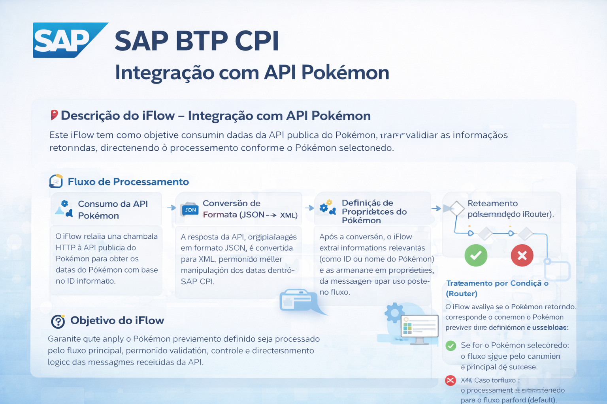

📌 Descrição do iFlow – Integração com API Pokémon

Este iFlow tem como objetivo consumir dados da API pública do Pokémon, transformar e validar as informações retornadas, direcionando o processamento conforme o Pokémon selecionado.

🔄 Fluxo de Processamento

Consumo da API Pokémon
O iFlow realiza uma chamada HTTP à API pública do Pokémon para obter os dados do Pokémon com base no ID informado.

Conversão de Formato (JSON → XML)
A resposta da API, originalmente em formato JSON, é convertida para XML, permitindo melhor manipulação dos dados dentro do SAP CPI.

Definição de Propriedades do Pokémon
Após a conversão, o iFlow extrai informações relevantes (como ID ou nome do Pokémon) e as armazena em propriedades da mensagem para uso posterior no fluxo.

Roteamento por Condição (Router)
O iFlow avalia se o Pokémon retornado corresponde ao Pokémon previamente definido como Pokémon escolhido:

✅ Se for o Pokémon selecionado: o fluxo segue pelo caminho principal de sucesso.

❌ Caso contrário: o processamento é direcionado para o fluxo padrão (default).

Tratamento conforme o Resultado
Cada rota pode executar ações específicas, como retorno da mensagem, log, transformação adicional ou tratamento alternativo.

🎯 Objetivo do iFlow

Garantir que apenas o Pokémon previamente definido seja processado pelo fluxo principal, permitindo validação, controle e direcionamento lógico das mensagens recebidas da API.

📊 Exemplo Prático do Fluxo

### Criando nosso Iflow

### Adicionando o Artefato do Integration Flow

### Adicionando o nome do Integration Flow

### Editando nosso Iflow

### Adicionar o HTTPS para o Sender para o Start

### 

### 

### 

### 

### 

### 

### 

### 

### 

### 

### 

### 

### 

### 
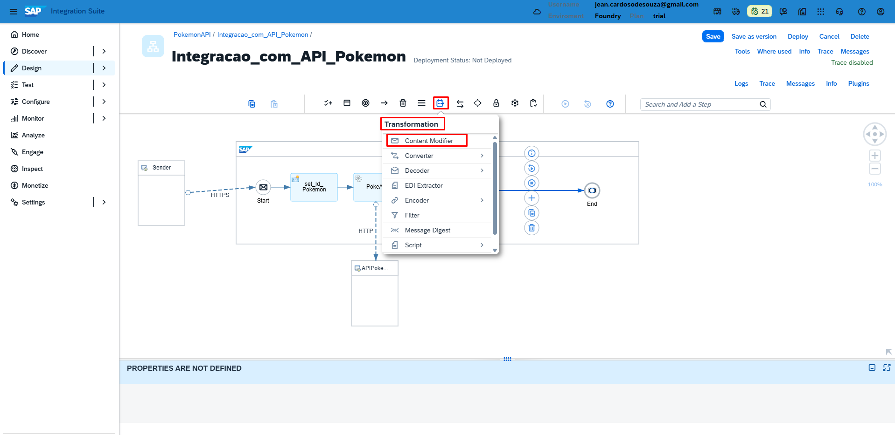

### 
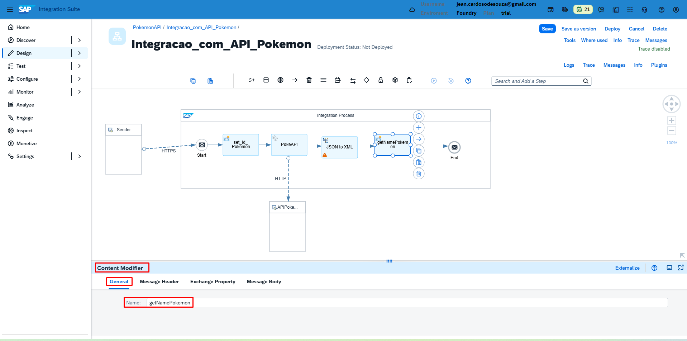

### 
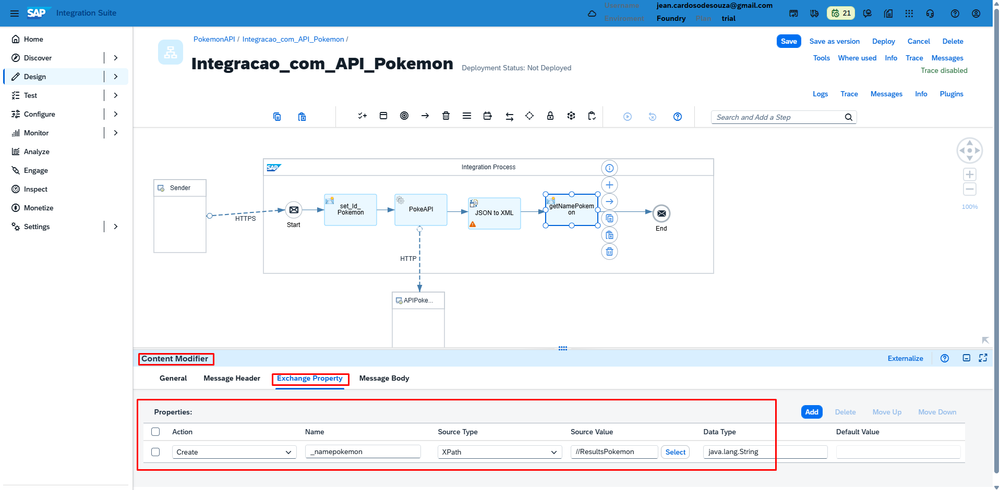

### 
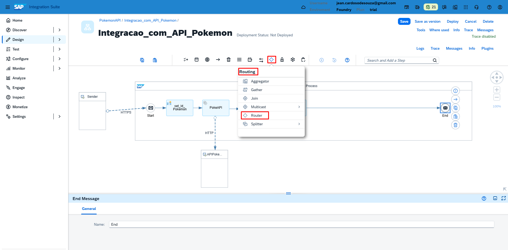

### 
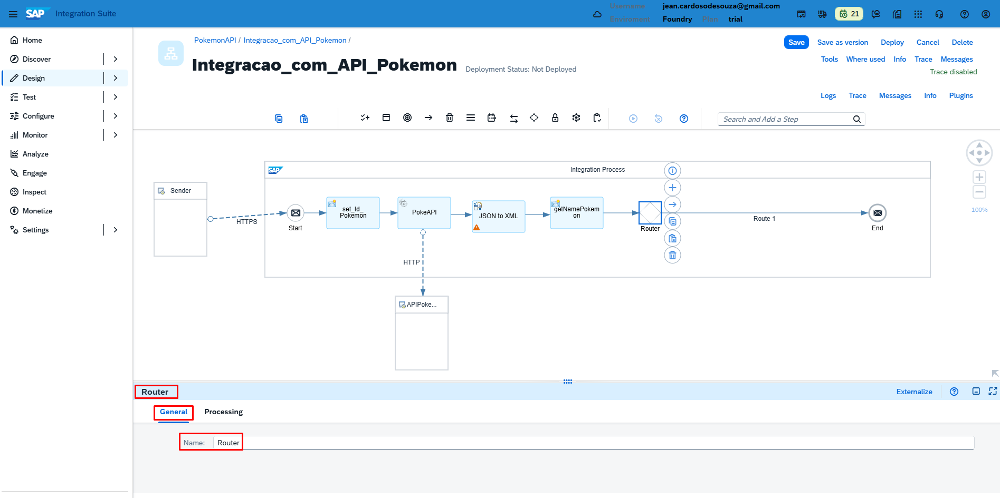

### 
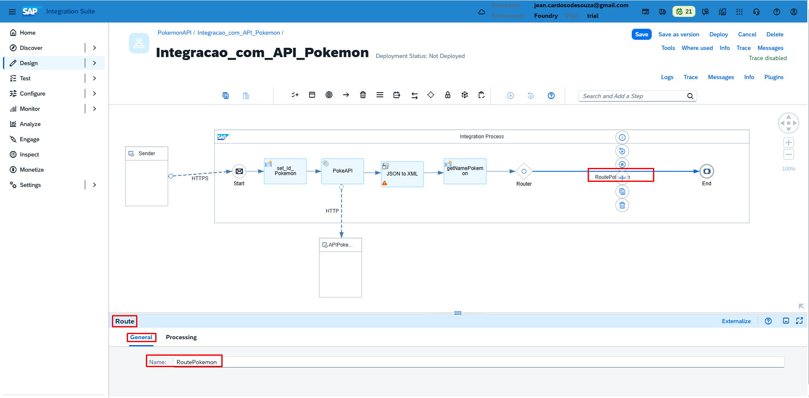

### 
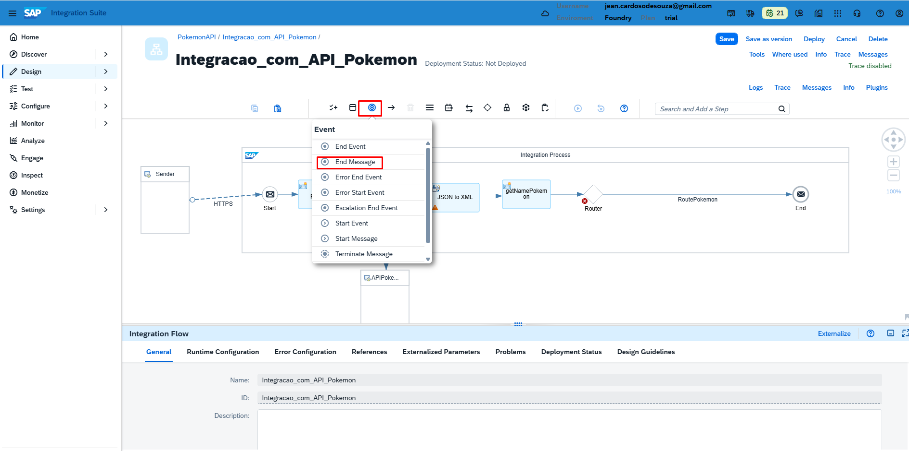

### 
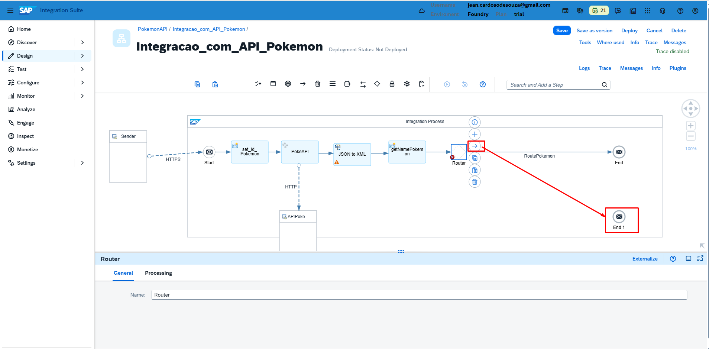

### 
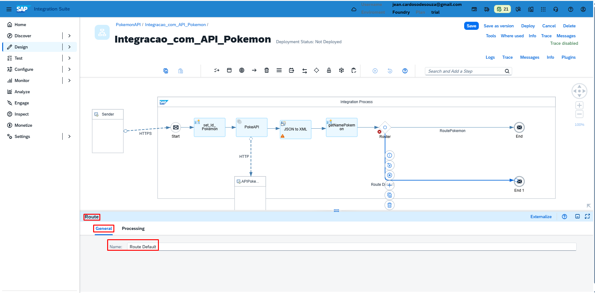

### 
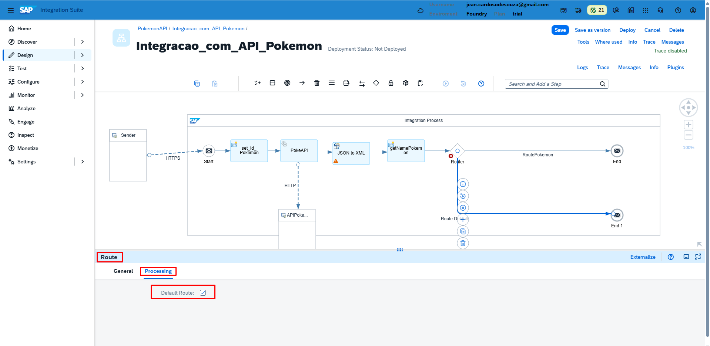

### 
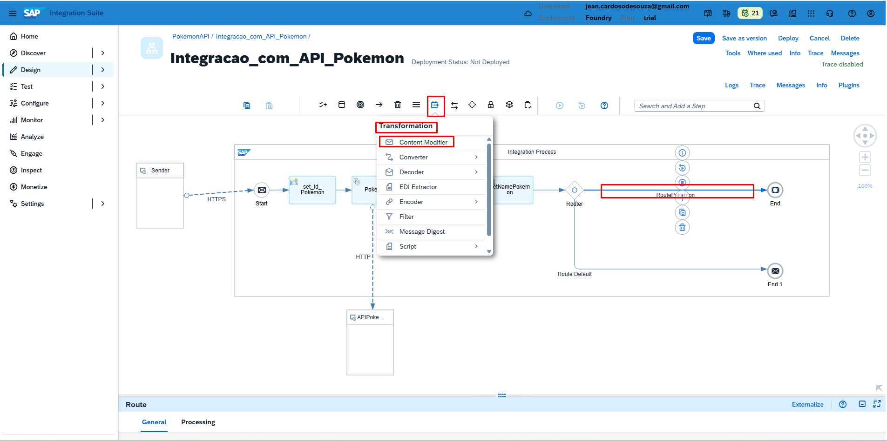

### 
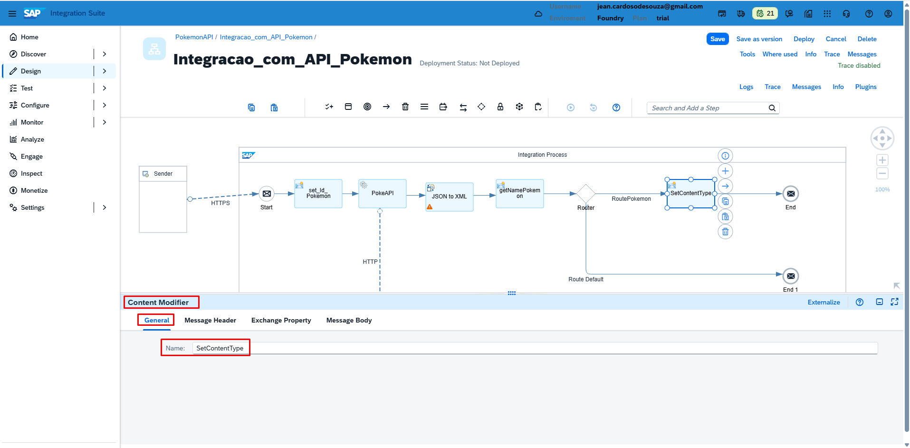

### 
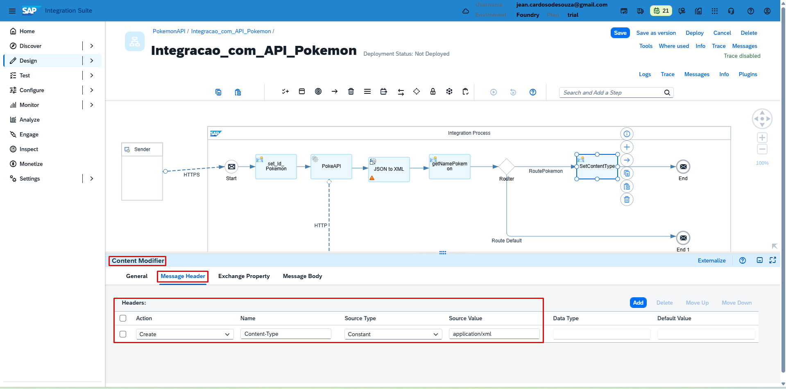

### 
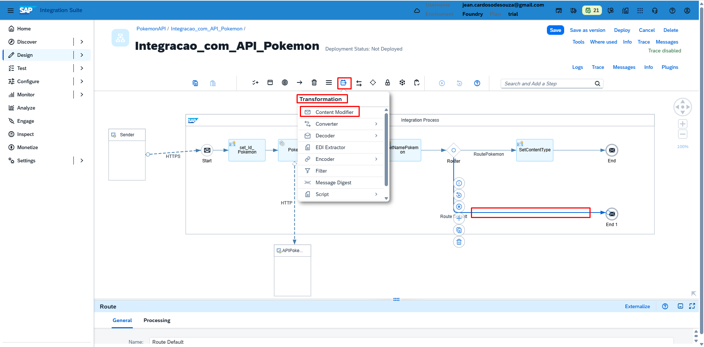

### 
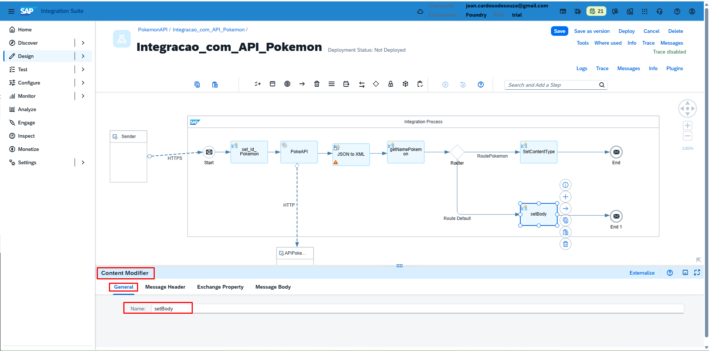

### 
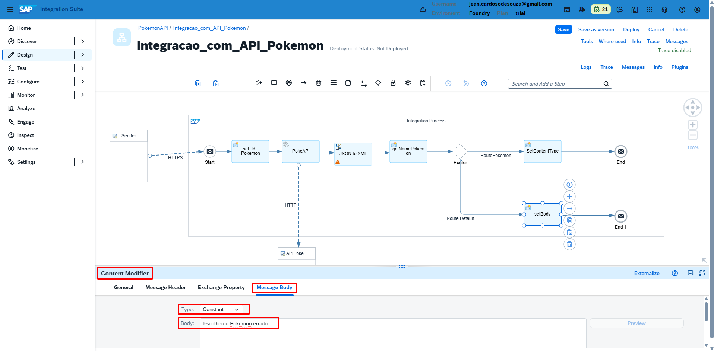

### 
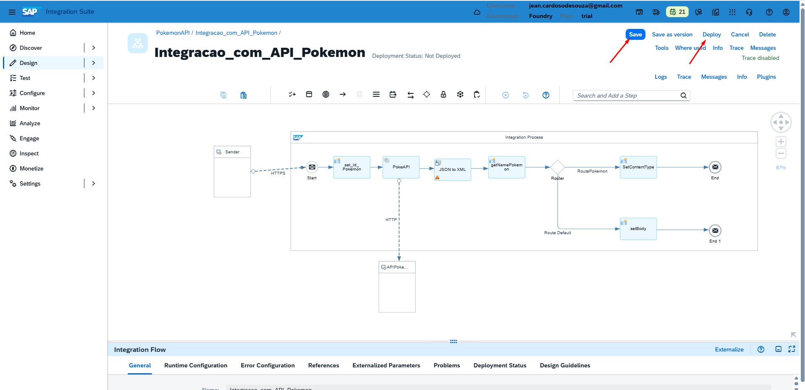

### Configuração no Postman
Adicionar a URL do Endpoint
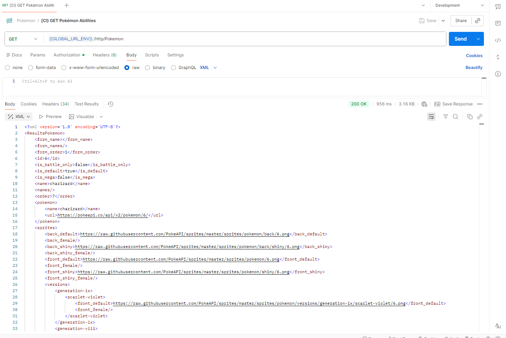

## 📦 Exemplo prático – iFlow para baixar

📦 [Download do iFlow – Package/PokemonAPI/Package/Integracao_com_API_Pokemon.zip](Package/PokemonAPI/Package/Integracao_com_API_Pokemon.zip)

> O arquivo pode ser importado diretamente no SAP Integration Suite (CPI).

